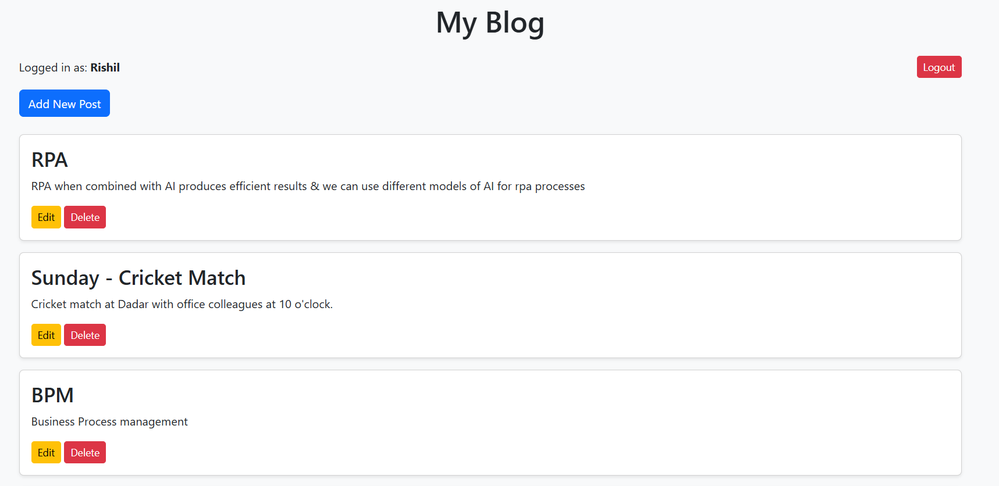
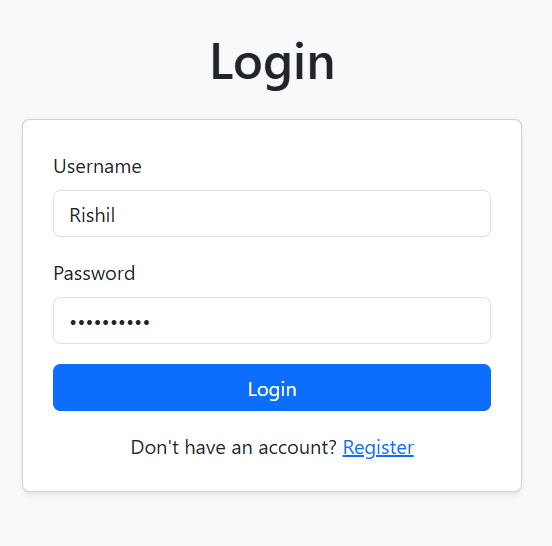
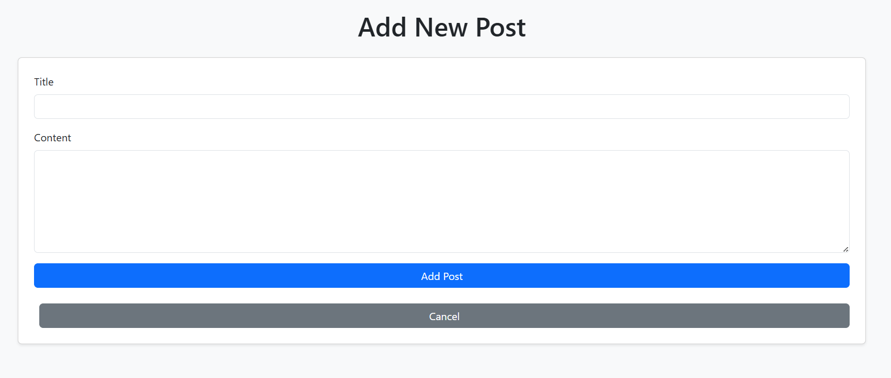
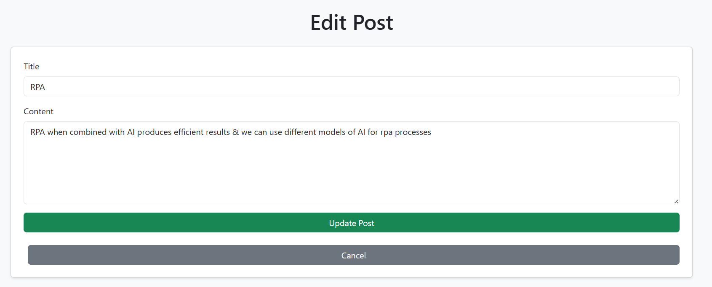

# flask-blog-app
# 📝 BlogApp — A Simple Flask Blogging Platform


A minimalistic yet fully functional **blog application built with Flask**.  
It allows users to **register, log in, create, edit, and delete blog posts**, with secure password management and an intuitive interface.

---

## 📸 Screenshots

1.HOME Page


2.LOGIN PAGE


3.ADD POST


4.EDIT POST PAGE


---

## 🚀 Features

✅ User Registration & Authentication  
✅ Create, Read, Update, Delete (CRUD) Blog Posts  
✅ Password Hashing (secure login system)  
✅ SQLite3 Database Integration  
✅ Flash Messages for User Feedback  
✅ Clean, Minimal UI with Flask Templates  
✅ Session-Based Login Management  

---

## 🧠 Tech Stack

| Category | Technology |
|-----------|-------------|
| **Backend** | [Flask](https://flask.palletsprojects.com/) |
| **Database** | SQLite3 |
| **Frontend** | HTML, CSS (Jinja2 templates) |
| **Security** | Werkzeug Password Hashing |
| **Language** | Python 3.9+ |

---

## ⚙️ Installation & Setup

Follow these steps to run the project locally:

### 1️⃣ Clone the repository
```bash
git clone https://github.com/rishil-fp-99/flask-blog-app.git
cd BlogApp
